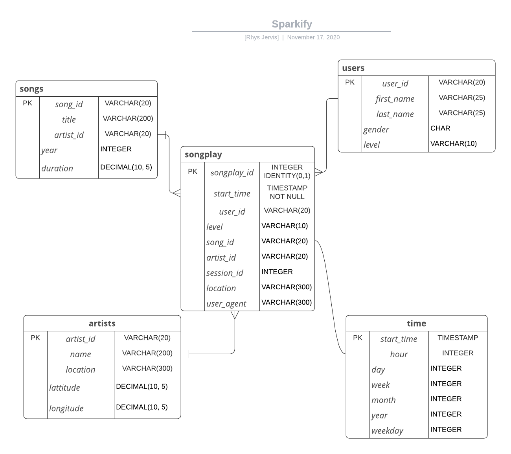

#  Data Warehousing - Sparikfy
Done as a requirement for Udacity's Data Engineering Nanodegree.
## Introduction 
Sparkify, a music streaming startup, wants to move their processes and data onto the cloud. Their data currently resides in S3, in a directory of JSON logs on user activity on the app, as well as a directory with JSON metadata on the songs in their app.

As their data engineer, you are tasked with building an ETL pipeline that extracts their data from S3, stages them in Redshift, and transforms data into a set of dimensional tables for their analytics team to continue finding insights in what songs their users are listening to. You'll be able to test your database and ETL pipeline by running queries given to you by the analytics team from Sparkify and compare your results with their expected results.

## Project Description
In this project, you'll apply what you've learned on data warehouses and AWS to build an ETL pipeline for a database hosted on Redshift. To complete the project, you will need to load data from S3 to staging tables on Redshift and execute SQL statements that create the analytics tables from these staging tables.

## Files
1. `s3://udacity-dend/song_data`  A subset of real data from the Million Song Dataset. Each file is in JSON format and contains metadata about a song and the artist of that song.The files are partitioned by the first three letters of each song's track ID. For example, here are filepaths to two files in this dataset. 

`song_data/A/B/C/TRABCEI128F424C983.json song_data/A/A/B/TRAABJL12903CDCF1A.json` 

And below is an example of what a single song file, TRAABJL12903CDCF1A.json, looks like.

'{"num_songs": 1, "artist_id": "ARJIE2Y1187B994AB7", "artist_latitude": null, "artist_longitude": null, "artist_location": "", "artist_name": "Line Renaud", "song_id": "SOUPIRU12A6D4FA1E1", "title": "Der Kleine Dompfaff", "duration": 152.92036, "year": 0}'

2. `s3://udacity-dend/log_data` Dataset of log files in JSON format generated by an event simulator based on the song_data in the dataset above.These simulate app activity logs from an imaginary music streaming app based on configuration settings. The log files in the dataset you'll be working with are partitioned by year and month. For example, here are filepaths to two files in this dataset.

    'log_data/2018/11/2018-11-12-events.json
      log_data/2018/11/2018-11-13-events.json'
    '{ "artist": "Gary Allen",
      "auth": "Logged In",
      "firstName": "Celeste",
      "gender": "F",
      "itemInSession": 2,
      "lastName": "Williams",
      "length": 211.225677,
      "level": "free",
      "location": "Klamath Falls, OR",
      "method": "PUT",
      "page": "NextSong",
      "registration": 1.841078e+12,
      "sessionId": 430,
      "song": "Nothing On But The Radio",
      "status": 200,
      "ts": 1541990258796,
      "userAgent": "\"Mozilla/5.0 (Windowa NT 6.1: WOW64) AppleWebkit...},
      "userid": 53'
      
3. `create_tables.py` Python script to create fact and dimension tables for the star schema in AWS Redshift
4. `etl.py` Python script to load data from S3 into staging tables on AWS Redshift and then process that data into your analytics tables on AWS Redshift
5. `sql_queries.py` Python script where sql queries are defined
6. `dwh.cfg` Contains necessay credentials to connect to AWS cluster 

### Schema

## Steps
Run the scripts in the following order:  
`create_tables.py  
`etl.py`

